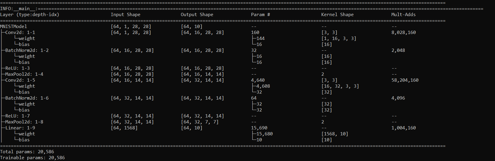

# MNIST Model Training Pipeline

A PyTorch-based deep learning pipeline for training and evaluating MNIST digit classification models with automated testing and CI/CD integration.

## Project Overview

This project implements a CNN-based model for MNIST digit classification with:
- Automated training pipeline
- GitHub Actions CI/CD integration
- Real-time training metrics visualization
- Model performance validation
- Automated testing framework

## Model Architecture

The model uses a simple but effective CNN architecture:
- 2 Convolutional layers with batch normalization
- MaxPooling layers
- Fully connected output layer
- Current accuracy: >95% on validation set
- Parameter count: <25,000

## Requirements

- Python 3.8+
- PyTorch
- torchvision
- pytest
- torchinfo
- tqdm
- numpy

## Installation

1. Clone the repository:
bash
git clone [repository-url]
cd [project-directory]

2. Create and activate a virtual environment (recommended):
```bash
# Windows
python -m venv venv
.\venv\Scripts\activate

# Linux/MacOS
python -m venv venv
source venv/bin/activate
```

3. Install dependencies:
```bash
pip install -r requirements.txt
```

## Project Structure

```
project/
├── src/
│   ├── __init__.py
│   ├── model.py        # MNIST model architecture
│   ├── config.py       # Configuration classes
│   └── train.py        # Training logic
├── tests/
│   ├── __init__.py
│   └── test_model.py   # Model tests
├── .github/
│   └── workflows/      # GitHub Actions pipeline
├── models/            # Saved model checkpoints
├── requirements.txt
└── README.md
```

## Usage

### Training the Model

Run the training script:
```bash
python src/train.py
```

Default configuration:
- Batch size: 64
- Learning rate: 0.001
- Epochs: 1
- Device: CUDA (if available) or CPU

### Running Tests

Execute tests using pytest:
```bash
# Windows
run_tests.bat

# Linux/MacOS
PYTHONPATH=$PYTHONPATH:$(pwd) pytest tests/
```

## Configuration

### Training Configuration (src/config.py)
```python
TrainingConfig:
    batch_size: int = 512
    learning_rate: float = 0.01
    epochs: int = 1
    device: str = "cuda"
```

### Model Configuration (src/config.py)
```python
ModelConfig:
    input_channels: int = 1
    num_classes: int = 10
```

## CI/CD Pipeline

The project includes GitHub Actions workflow that:
1. Sets up Python environment
2. Installs dependencies
3. Trains the model
4. Runs tests
5. Uploads trained model as artifact

## Model Artifacts

Trained models are saved with the following metadata:
- Timestamp
- Training accuracy
- Validation accuracy
- Model state dict
- Optimizer state dict
- Training configuration

## Testing

The testing framework validates:
1. Model parameter count (<25,000 parameters)
2. Training accuracy (>95% required)
3. Model architecture consistency

## Contributing

1. Fork the repository
2. Create your feature branch
3. Commit your changes
4. Push to the branch
5. Create a Pull Request

## License

This project is licensed under the MIT License - see the LICENSE file for details.
```

This README provides a comprehensive overview of your project, including:
- Clear installation instructions
- Project structure explanation
- Usage guidelines
- Configuration options
- CI/CD pipeline details
- Testing framework information
- Contributing guidelines

The format is clean and well-organized, making it easy for users to understand and use your project. You may want to add:
1. Specific version numbers in requirements.txt
2. Your actual repository URL
3. Any additional screenshots or visualizations
4. More detailed contribution guidelines if needed